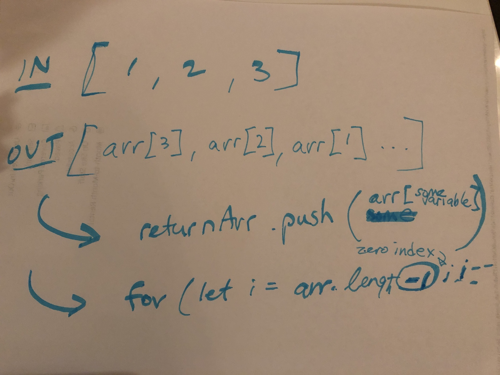

# Reverse an Array
Given any array, without using any built-in methods, return a reversed array.

## Challenge
Reverse an array with no

## Approach & Efficiency
Question: Am I meant to reverse it in-place? 
The approach was to use a for() loop to iterate through the array, starting at the end and working forward. 
Each time you loop through, push the current element to the returnArray. 
The return array will become a reversed version of the input array.

## Solution
