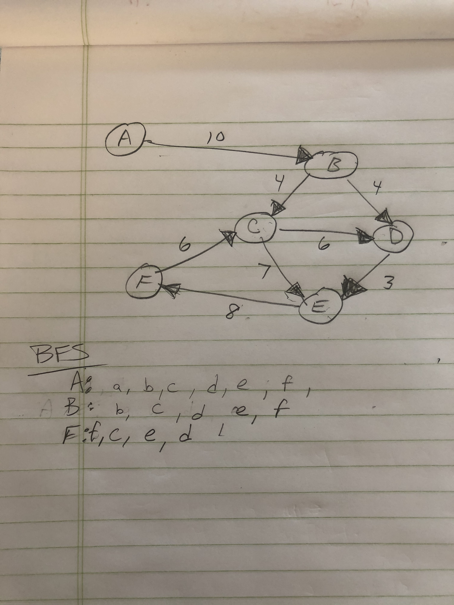

# Graphs
A graph is a very useful data structure. It is a tree with no guarantee that there wont be a cycle. Nodes 'lower down' on the tree can reference nodes higher up as their 'next' or a 'neighbor'

## Challenge
Implement a generic graph. Write some common prototype methods for getting all nodes, getting neighbors of a node, etc. 

## Approach & Efficiency
I chose to implement this in TS. It is a good challenge for me and it helps me develop more useful skills. 
The approach I took was to use an interface to define the shape of the node and the edge, and a class to define the graph itself. 

The class has a prototype function for each of the required feature tasks. 

getNodes() and getNeighbors() both return copies of the data they are referenceing. This prevents people from being able to manipulate the graph from outside. 

## API

    getNodes(): Array<GraphNode> --> { value: number, edges: Array<GraphNode> }

    getNeighbors(GraphNode): Array<GraphNode>

    addEdge(weight: number, from: GraphNode, to: GraphNode): void --> graphEdge: { weight: number, to: GraphNode }

    addNode(value: number): GraphNode --> returns a copy of the node that was added

    size(): number --> returns the number of nodes in the graph.

## BFS

This section talks about a breadth first traversal of the graph. Since my graph is directional, onnly connections in the right direction will count as connections, as far as the traversal algoritm is concerned.

### time complexity

In the worst case, in a very complete graph, my BFS will be O(n^2). In the best case

Calculating:

        We are guaranteed to visit every node in the array. --> n
        For every neighbor of every node, we will run an iteration of the for() loop in the center of the function --> n-1

The result is `n * n-1` which simplifies to O(n^2)

### Space complexity

Space complexity is O(n). We create two data structures within the function, on is the Set of visited nodes, and one is the queue. The queue could be up to n size, so we will say 2n for overall size. 

