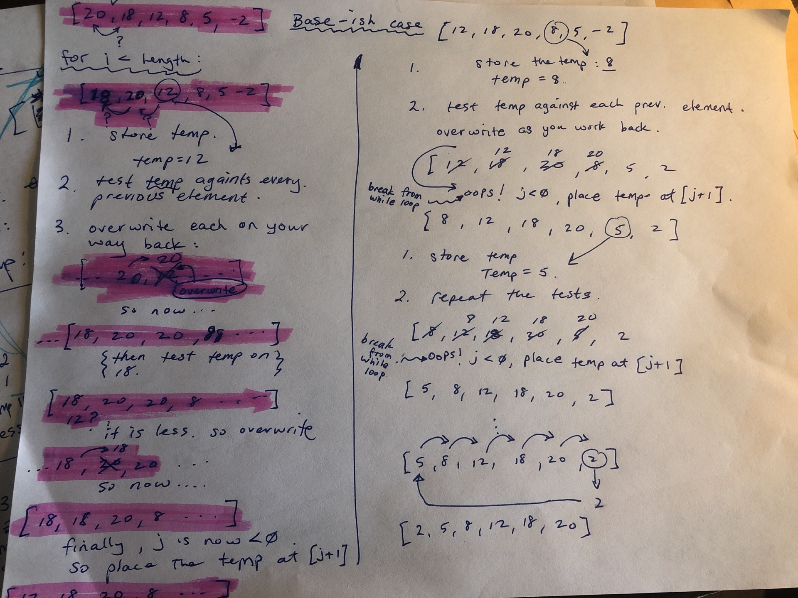

# Challenge Summary
Learn the insertion sort. Convert some pseudo code to code. Write tests

## Challenge Description
<!-- Description of the challenge -->

## Approach & Efficiency
The approach of the insertion sort is to pull out an element 'i' and store it as the temp. 
Check this temp against every preceding element until you find one where either 1.) the element your checking has an index of -1 or 2.) the element youre checking is less than the temp. As you go, make sure that you 'shift' each checked element forward one space in the array. You will be creating duplicates as you go.. ie if 5 is the temp.: `[ 10,20,5,40 ]` will become `[ 10,20,20,40 ]`,  and then `[ 10, 10, 20, 40 ]` at some point in its sorting process. Eventually the duplication/shifting routine will reach the beginning of the array and the temp will be inserted in place of the 10. >> `[ 5,10,20,40 ]`

## Efficiency.
O(n^2). Time complexity
O(1) Space complexity. 

Time complexity is n-squared because for every temp, i, (the length of the array), the worse case is that you will have to traverse all the way to the beginning. So even though it's not exactly n^2, that's to say it's not a *square*, it is still exponential in its complexity. 

