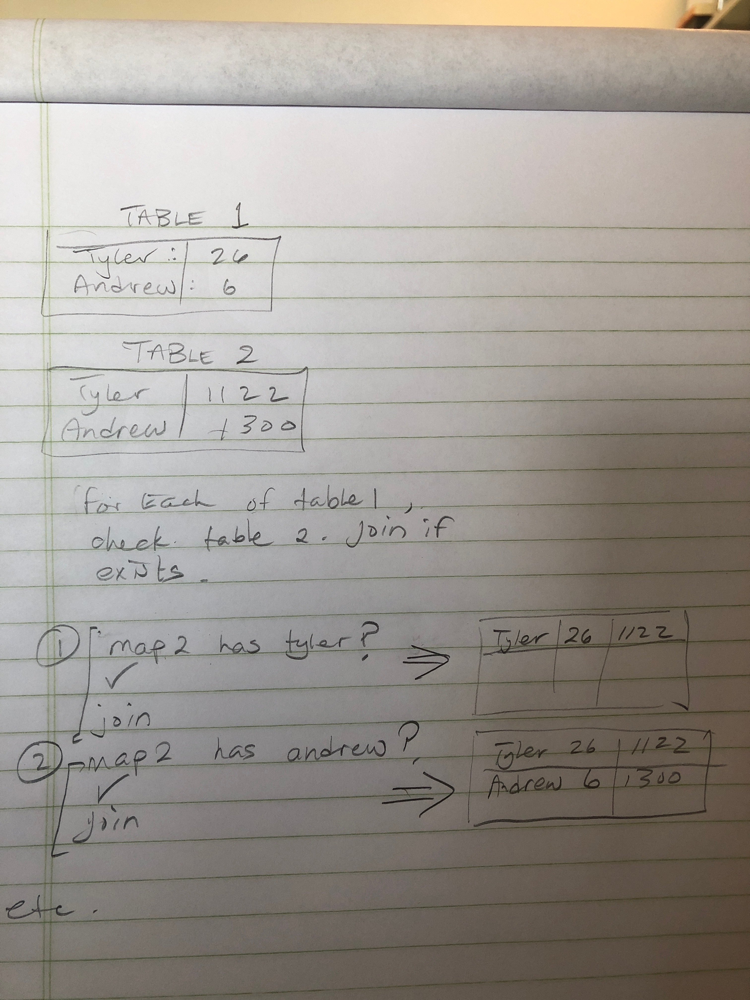

# Left-join

The idea behind a join is to attach one table to the side of another. With a left-join, the second table is joined to the first and with a right join the first table is joined to the second. One table is the **base** and the other table is the **addition**. Left / right just determines the direction. 

### How are things joined? 

Exactly **how** things are joined is important. the one rule is
    The **base** is copied entirely, and only keys on the **addition** that *match* keys in **base** are joined. 

ex: 

If the **base** was: 

```
name phone

tyler 11111111
ben   22222222
```

and the **addition** was

```
name  age

tyler  
andrew  6
ben     80
```

they would join to

```
name  phone  age

tyler 111111  null
ben . 222222   6
```

We can see that `ben` was left out, since that key only existed on the addition table.  Tyler's age was `null`, so it joined to `null`


## Problem

Write a function that performs a join on two hash Maps. 

## Solution

- Take in two maps.
- forEach of the entries on the first map, check if the second map has that entry too.
- **if so**, change the value of the first Maps entry to be the combination of the two entries. 
- **if not** dont change the entry. 
- return the modfied first map. 

The solution can be stretched to allow for a right-join easily by switching which Map is assigned as the **base** and which is assigned as the **addition**.



