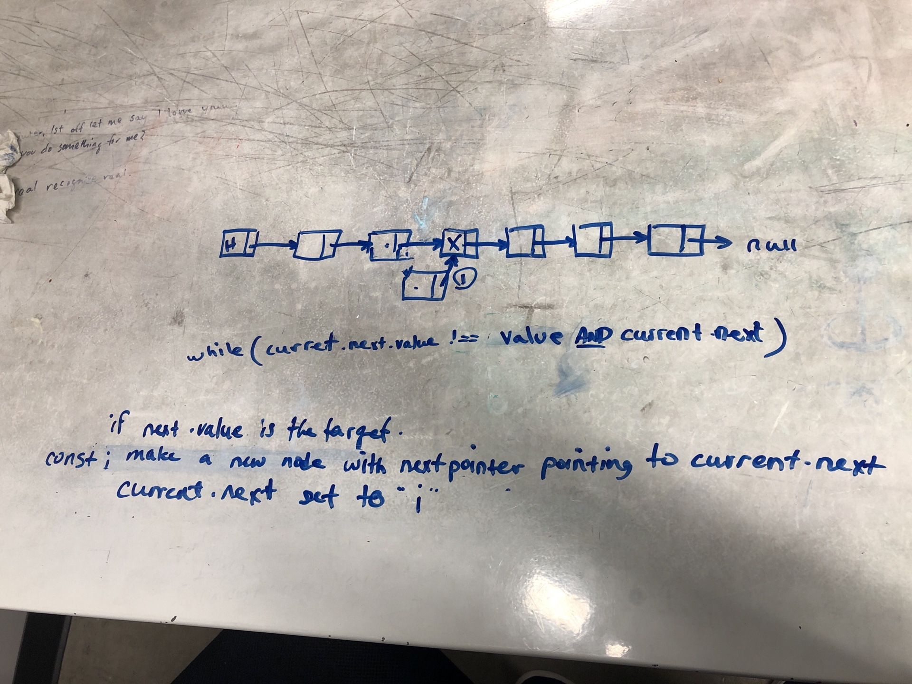
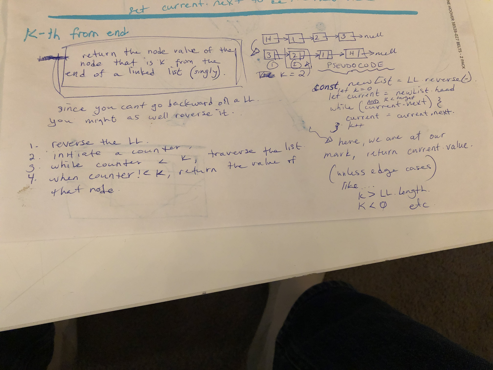

# Singly Linked List
<!-- Short summary or background information -->
So ya. Singly linked lists are fun to work with! 
Background: A linked list is a type of data structure. Im not sure what it would be good for yet, but they seem to be fairly flexible. Large tradeoff with computational expense though. Much to be learned! 

## Challenge
<!-- Description of the challenge -->
The challenge was to implement our hello world of linked lists. Create a node class and a List class and be able to instantiate a linked list. Make prototype functionality for inserting at the beginning, appending to the end, and finding (returns boolean). Additional functionality is ongoing. See below "API" section.

## Approach & Efficiency
<!-- What approach did you take? Why? What is the Big O space/time for this approach? -->

All of the functions in the Linked list class are O(n) time-complexity, with two exeptions. 'Insert' is O(1) expensive and kthFromEnd() is 3 * O(n). SO that's cool. If you have a log of nodes to stick on to the end of a linked list, it is much more efficient to reverse your list, INSERT (instead of append) all of the nodes, and then reverse it back. 

The kthFromEnd function approaches the problem of not being able to traverse a LL in reverse by reverseing the LL, traversing it forwards, and then reverseing it back. 

## API
<!-- Description of each method publicly available to your Linked List -->

Testing included 8 tests, which effectively test the entire functionality of the two classes. The tests are fairly dense, especially for the insertBefore / after functions. A single test was sufficient to determine behavior for both invalid and valid inputs. More testing is always better... but this is functional!

Replicate my tests by:

`npm i`
`npm test linked-list.test.js`

`LinkedList.reverse()`

reverses the Linked List: O(n)
- input

none

- output

none

`LinkedList.find()`

determine weather or not an element exists on the list: \<= O(n)
- input

value to be searched for in the list.

- output

boolean

`LinkedList.append()`

adds a new node to the end of the list: O(n)
- input

primitive value to be appended.

- output

none

`LinkedList.insert()`

adds a new value to the beginning of the list: O(1)
- input

primitive to be added to the front of the list.

- output

none

`LinkedList.toString()`

prints the list via console.log().
- input

none

- output

{headVal}->{val1}-> ... etc.

`LinkedList.insertBefore(target, newVal)`

- input

target: the value of the node before which to insert the new node. 

newVal: the value that will be contained in the new node to be inserted.

-output

none;

`LinkedList.insertAfter(target, newVal)`

- input

target: the value of the node after which to insert the new node. 

newVal: the value that will be contained in the new node to be inserted.

`LinkedList.kthFromEnd(k)`

- input: 

k: the number of spaces from the end from which to pull the return value.

- output: 

the value of the node at that space.

`zipLL(listA, listB)`

- input: two linked lists to be 'zipped' together.

- output: a single linked list that is the result of the two previous linked lists being zipped. 

- behavior: if one list is shorter than the other, the resulting list will still contain the rest of the tail of the longer list.

