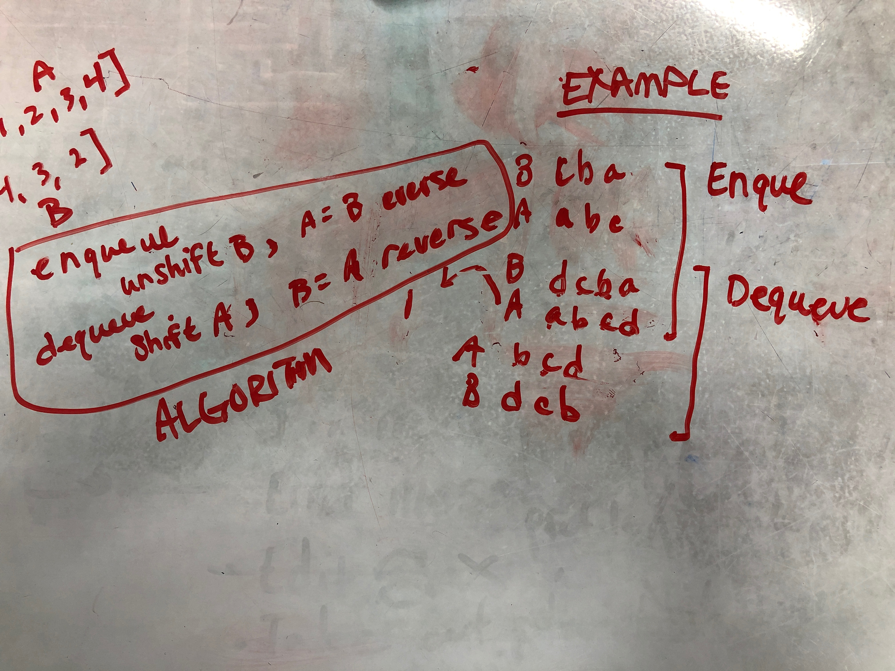

# Challenge Summary
<!-- Short summary or background information -->
Create a Queue class without using any methods normally available to a Queue class. Instead use two Stacks to accomplish the same thing. 

Ie: Create a PseudoQueue class that functions like a Queue class, but takes in two Stacks during instantiation and uses only their prototype methods to accomplish the behavior.

## Approach & Efficiency
<!-- What approach did you take? Why? What is the Big O space/time for this approach? -->
#### PseudoQueue
My pseudoqueue class takes a Stack in its constructor.

The approach for solving the problem was to create a duplicate Stack inside the constructor that would have a reversed storage. With these two mirror-image storages, you can use methods that only work on one end of the storage arrays to accomplish the queue tasks. `pop()` and `push()` prototype methods only work on the front end of the storage, and they are well suited for the task.

By having a two mirror-image storages, you have both the end and the beginning of a queue available for your reference at the same end of the arrays. See 'Example' within the solution image.

## Solution
