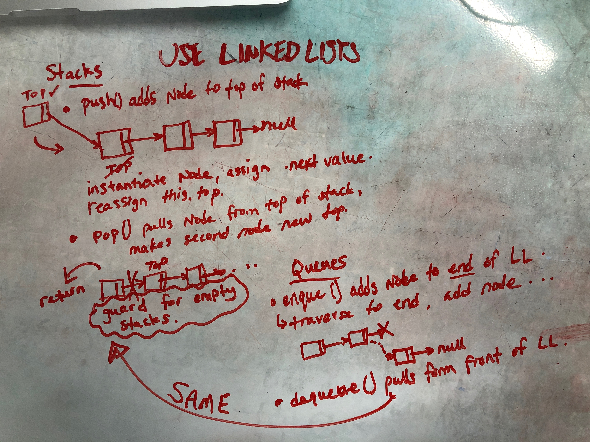

# Stacks and Queues
<!-- Short summary or background information -->
Create a Stack and Queue classes to perform various tasks with data.

Create prototype methods for the two different types of data storage, which allow the user to push, pop, enqueue, and equeue items from the lists. The items themselves are Nodes (with a value and a next); 

## Approach & Efficiency
<!-- What approach did you take? Why? What is the Big O space/time for this approach? -->
Singly linked lists seemed appropriate for this challenge. 

### Stack
For Stack, `push()` instantiates a new node and assigns `top` to that node. `pop()` is the opposite. It just reassigns `top` to the next node in the stack.

### Queue
`enqueue()` traverses down the list with a while loop and sticks the new Node at the end.
`dequeue()` performs the same task as `stack.pop()`.

## API
<!-- Description of each method publicly available to your Stack and Queue-->

